# ChatterBox - Aplikasi Komunitas Diskusi Publik


ChatterBox adalah aplikasi komunitas berbasis web yang dirancang untuk memfasilitasi pengguna dalam melakukan diskusi dan berbagi informasi mengenai berbagai topik secara terbuka. Dengan adanya platform ini, Pengguna dapat membuat postingan topik diskusi baru, memberikan tanggapan melalui komentar, serta menilai postingan dengan fitur like dan dislike. ChatterBox hadir sebagai ruang interaksi publik yang bersifat dinamis, informatif, dan mendorong pertukaran gagasan secara konstruktif.

## Daftar Isi
- [Fitur Utama](#fitur-utama)
- [Tech Stack](#tech-stack)
- [Persyaratan Sistem](#persyaratan-sistem)
- [Instalasi](#instalasi)
- [Konfigurasi](#konfigurasi)
- [Role & Permissions](#role--permissions)
- [Fitur Berdasarkan Role](#fitur-berdasarkan-role)
- [Screenshot](#screenshot)
- [Struktur Database](#struktur-database)
- [Penggunaan](#penggunaan)
- [Deployment](#deployment)
- [Kontribusi](#kontribusi)
- [Lisensi](#lisensi)

## Fitur Utama

### 1. Manajemen Postingan
✅ **CRUD Postingan**
Pengguna dapat membuat, melihat, mengedit, dan menghapus postingan. 

✅ **Kategori Postingan**
Pengguna dapat memilih dan  menjelajahi postingan berdasarkan kategori yang dipilih melalui menu Jelajahi Topik.

### 2. Interaksi Pengguna
✅ **Voting (Like / Dislike)**
 Pengguna dapat memberikan aksi berupa like atau dislike pada postingan pribadi / orang lain serta pengguna dapat melihat daftar like dan dislike pada postingan pribadi melalui menu Daftar Suka.

✅ **Komentar & Balasan Komentar**
Pengguna dapat memberikan komentar pada postingan pribadi dan postingan orang lain, serta dapat membalas komentar orang lain.    

✅ **Notifikasi**
Pengguna mendapatkan notifikasi untuk komentar baru, balasan komentar, aksi like & dislike serta laporan postingan. 

### 3. Moderasi Konten
✅ **Report Postingan**
Pengguna dapat melaporkan postingan beserta alasan sesuai pilihan kategori laporan dan laporan akan ditinjau oleh admin.   

### 4. Personalisasi dan Pengalaman Pengguna
✅ **Daftar Postingan**
Pengguna dapat melihat daftar postingan yang telah dibuat melalui menu Postingan Saya.

✅ **Profil Pengguna**
Pengguna dapat mengubah foto profil melalui menu Postingan Saya ataupun dengan mengklik foto profil.

### 5. Halaman Informasi
✅ **FAQ & Bantuan**
Pengguna yang memiliki kendala dapat memilih menu Lihat Bantuan dan FAQ untuk melihat pertanyaan dan solusi dari masalah yang umumnya terjadi di pengguna.

## Tech Stack

### Backend
- **Laravel 12.36.1** - - PHP Framework
- **MySQL** - Database

### Frontend
- **HTML** - Struktur halaman
- **CSS** - Styling tampilan aplikasi
- **JavaScript** - Interaksi dinamis browser

### Libraries & Tools
- **Node.js & NPM** - Pengelola dependency frontend dan menjalankan Vite
- **Composer** - Dependency manager untuk PHP & Laravel
- **Laravel Artisan CLI** - command line tool (`php artisan`)
- **Vite Asset Builder** - Asset builder untuk CSS & JavaScript

## Persyaratan Sistem
- PHP >= 8.2  
- MySQL >= 5.7 atau MariaDB >= 10.3
- Composer  
- Node.js dan NPM
- Web Server (Apache/Nginx)  
- Ekstensi PHP yang dibutuhkan:
  - OpenSSL
  - PDO
  - Mbstring
  - Tokenizer
  - Ctype
  - JSON
  - GD

## Instalasi
### 1. Clone Repository
```bash
git clone https://github.com/aidilsaputrakirsan-classroom/final-project-cloud-computing-a-cc-kelompok-3-musketeer.git
```
### 2. Install Dependencies

```bash
# Install PHP dependencies
composer install

# Install Node dependencies
npm install
```

### 3. Setup Environment

```bash
# Copy file environment
cp .env.example .env

# Generate application key
php artisan key:generate
```

### 4. Konfigurasi Database

Edit file `.env`:

```env
DB_CONNECTION=mysql
DB_HOST=127.0.0.1
DB_PORT=3306
DB_DATABASE=chatterbox
DB_USERNAME=root
DB_PASSWORD=
```

### 5. Migrasi Database

```bash
# Jalankan migrasi dan seeder
php artisan migrate --seed

# Atau jika ingin fresh install
php artisan migrate:fresh --seed
```

### 6. Build Assets

```bash
# Development
npm run dev

# Production
npm run build
```

### 7. Jalankan Aplikasi

```bash
# Development server
php artisan serve
```

Aplikasi akan berjalan di: `http://localhost:8000`
```

## Konfigurasi

### Email Configuration
Saat ini aplikasi ChatterBox belum menggunakan fitur pengiriman email seperti verifikasi akun, reset password, maupun notifikasi ke email pengguna. 
```

## Role & Permissions
Sistem menggunakan 2 role utama dengan permission berbeda:

| Role | Deskripsi |
|------|-----------|
| **User** | Pengguna dapat membuat postingan dan berinteraksi dengan postingan |
| **Admin** | Admin sebagai pengelola laporan postingan dari User 

## Fitur Berdasarkan Role

### User
```
- Membuat / melihat / mengedit / menghapus postingan  
- Memberikan komentar dan balasan komentar
- Melakukan voting postingan (Like/Dislike)
- Melihat daftar pengguna yang memberikan voting Like / Dislike 
- Melaporkan postingan beserta alasan laporan
- Menerima notifikasi
- Mengelola profil
- Melihat & mengelola daftar postingan pribadi
- Menjelajahi kategori dan postingan
 ```
  
### Admin
```
- Melihat daftar laporan postingan dari User
- Memberikan aksi terhadap laporan (Menerima/Menolak)
- Melihat riwayat laporan postingan dari User
- Memberikan notifikasi status laporan kepada user   

```
## Screenshot
### 1. Halaman Login
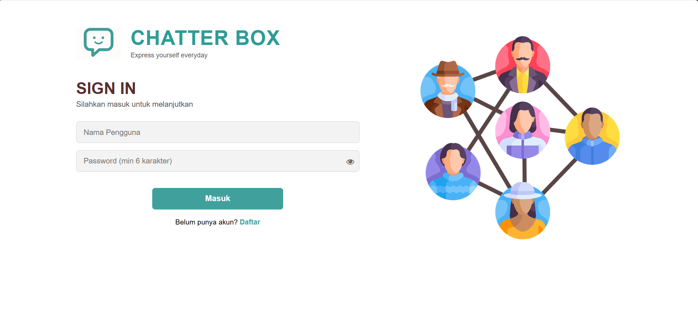
*Halaman login dengan form email dan password*

### 2. Halaman Register
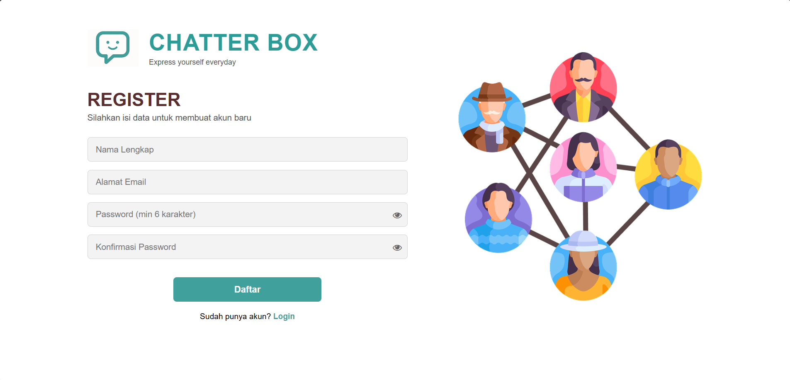
*Halaman Register dengan form nama lengkap, email, password, dan konfirmasi password*

### 3. Halaman Diskusi

*Halaman yang menampilkan daftar postingan*

### 4. Halaman Membuat Postingan
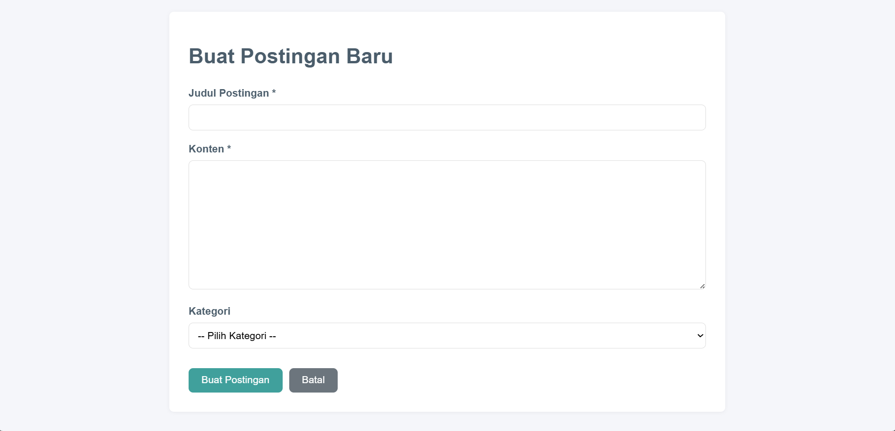
*Halaman Membuat Postingan dengan form judul, isi konten, dan pilihan kategori*

### 5. Halaman Edit Postingan
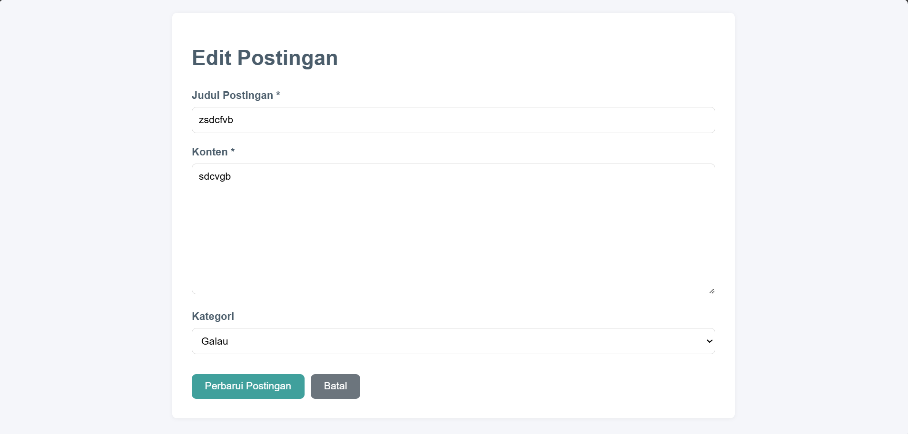
*Halaman membuat postingan dengan form judul, isi konten, dan pilihan kategori*

### 6. Halaman Detail Postingan
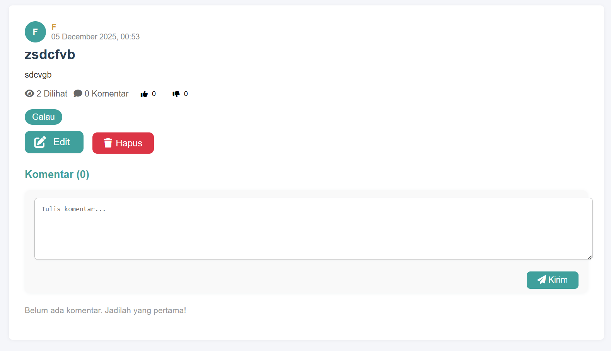
*Halaman yang menampilkan detail postingan pengguna dan isi komentar*

### 7. Halaman Jelajahi Topik
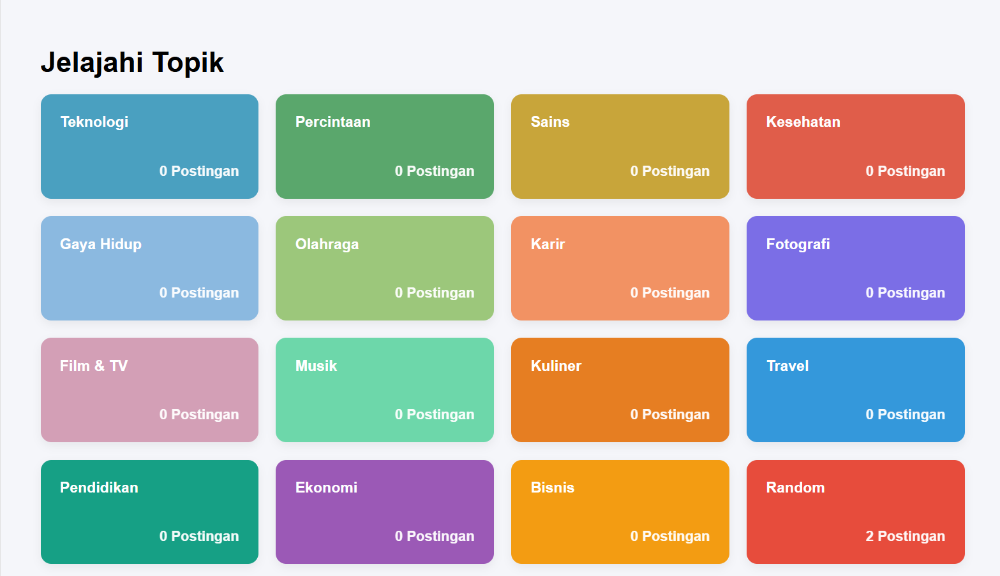
*Halaman yang menampilkan beberapa kategori postingan yang dapat dipilih pengguna untuk melihat daftar postingan dengan kategori yang dipilih*

### 8. Halaman Postingan Saya
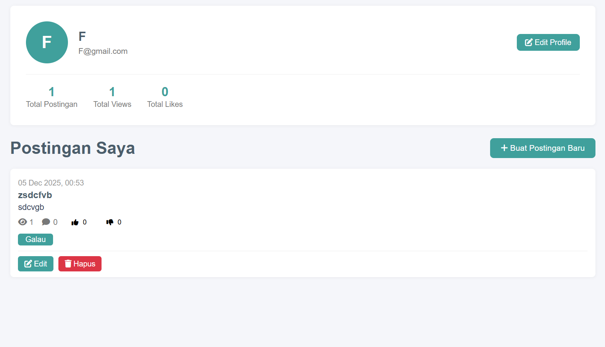
*Halaman yang menampilkan daftar postingan serta profil pengguna*

### 9. Halaman Daftar Suka
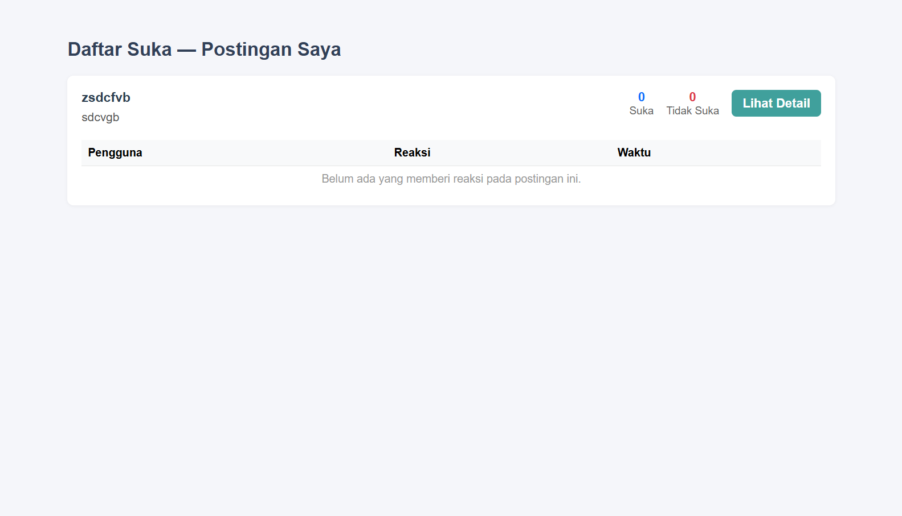
*Halaman yang menampilkan daftar pengguna yang melakukan aksi like atau dislike pada postingan pribadi pengguna*

### 10. Tampilan Melaporkan Postingan
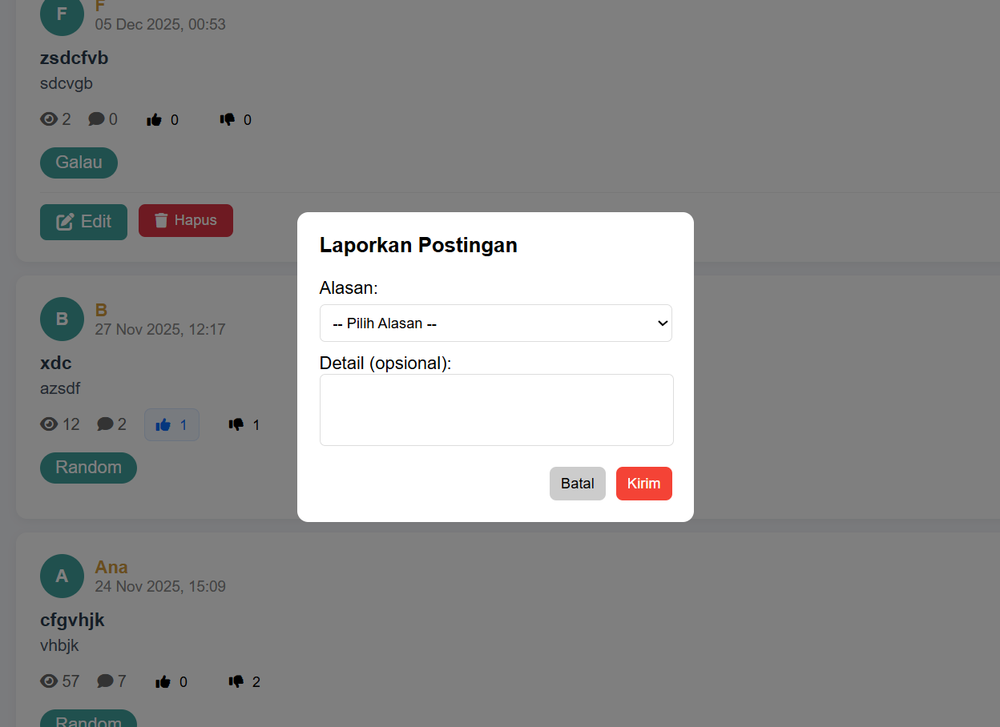
*Tampilan pelaporan terhadap postingan orang lain*

### 11. Halaman Laporan Postingan
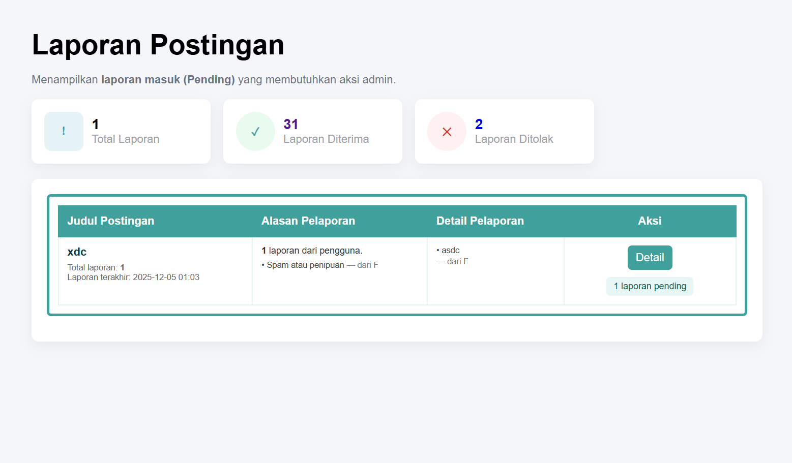
*Halaman yang menampilkan daftar laporan postingan dari pengguna*

### 12. Halaman Detail Laporan
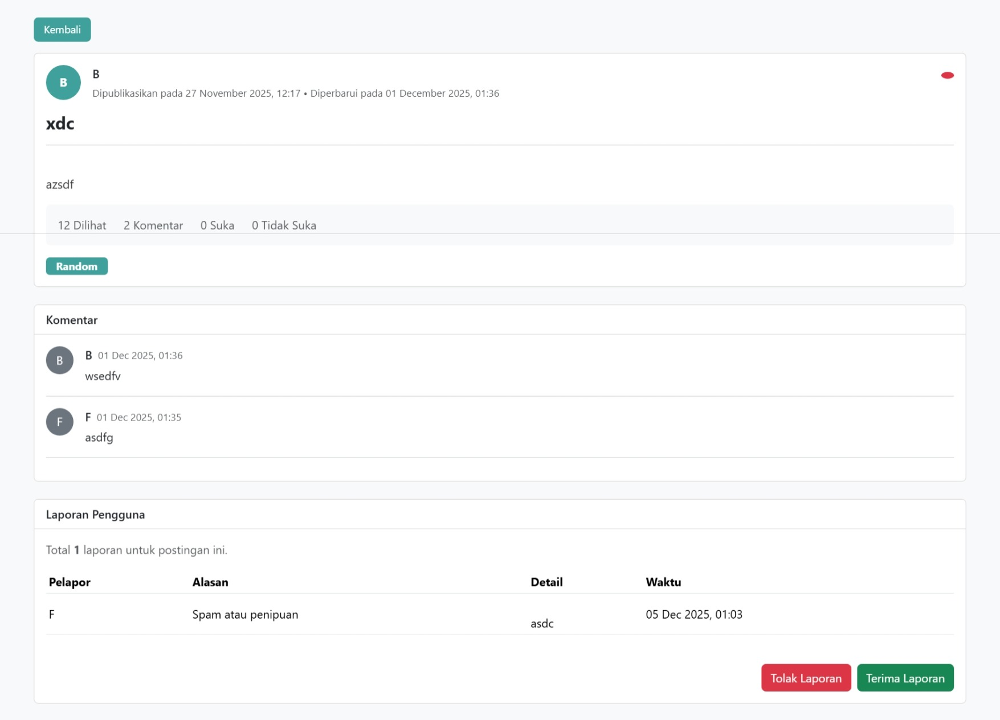
*Halaman yang menampilkan detail laporan dari pengguna*

### 13. Tampilan Notifikasi Postingan dihapus karena dilaporkan
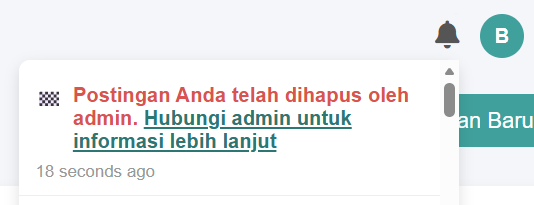
*Tampilan notifikasi saat laporan diterima Admin*

### 14. Tampilan Notifikasi
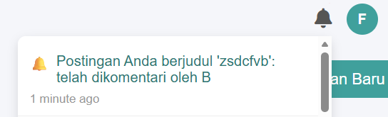
*Tampilan notifikasi saat pengguna mengomentari postingan pribadi*

### 15. Tampilan Notifikasi
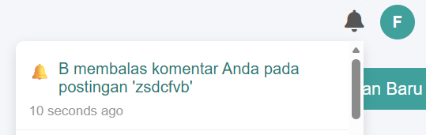
*Tampilan notifikasi saat terdapat pengguna membalas komentar pribadi*

### 16. Tampilan Notifikasi
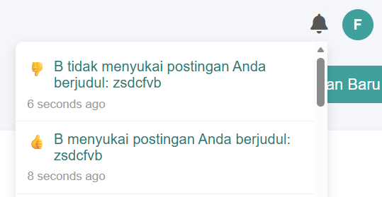
*Tampilan notifikasi saat pengguna melakukan like/dislike postingan pribadi*

### 17. Halaman History Laporan
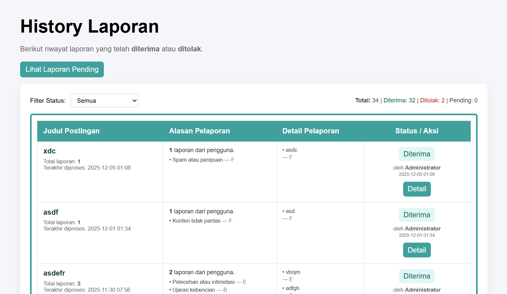
*Halaman yang menampilkan daftar riwayat laporan pengguna*

### 18. Halaman Lihat Bantuan & FAQ
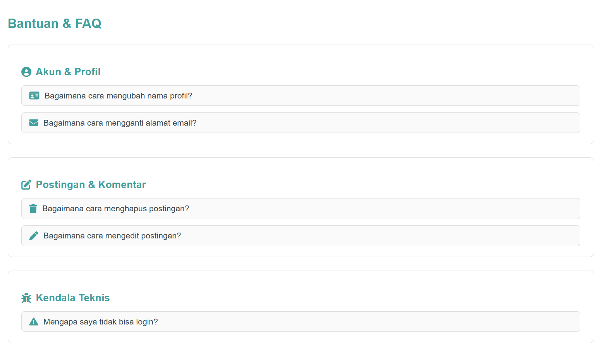
*Halaman yang menampilkan daftar pertanyaan yang dapat membantu permasalahan umum yang dihadapi pengguna*

### 19. Halaman Detail Bantuan & FAQ
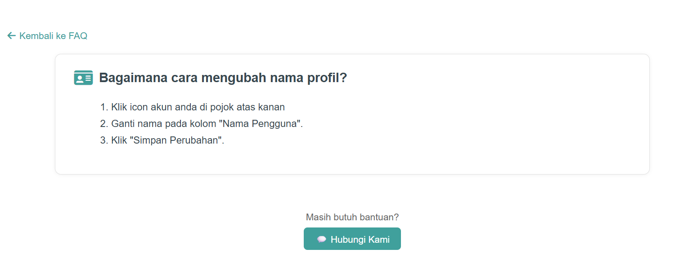
*Halaman yang menampilkan jawaban yang membantu pengguna sesuai dengan pertanyaan yang dipilih*
```

```
## Struktur Database
### Tabel Utama
```
- **users** - Data akun pengguna sistem (User & Admin), termasuk foto profil
- **posts** - Data postingan yang dibuat oleh user
- **comments** - Data komentar dan balasan komentar pada postingan   
- **categories** - Data kategori yang digunakan untuk mengelompokkan postingan  
- **reports** - Data laporan postingan dari user ke admin (beserta alasan laporan dan status) 
- **notifications** - Data notifikasi untuk setiap aktivitas (komentar, balasan, voting, status laporan)
- **reactions** - Data voting like/dislike pada postingan (mencatat user dan status reaksi)  
```

### Relasi Database
```
users (1) --- (n) posts
users (1) --- (n) comments
posts (1) --- (n) comments
posts (n) --- (1) categories
posts (1) --- (n) reports
posts (1) --- (n) reactions
users (1) --- (n) notifications
```

## Arsitektur & Komponen

### Arsitektur Aplikasi

Aplikasi ChatterBox dibangun menggunakan arsitektur **MVC (Model View Controller** bawaan Laravel, yang memisahkan logika aplikasi, tampilan, dan pengelolaan data, sehingga pengembangan lebih terstruktur dan mudah dikembangkan:

- **Controllers** - Business logic dan routing
- **Models** - Data utama (Users, Posts, Comments, Reactions, Reports, Notifications)
- **Middleware** - Pengaturan akses User & Admin
- **Views** - Tampilan halaman UI
- **Routes** - Rute navigasi aplikasi
- **Assets** - Tampilan tema & interaksi UI
- **Notifications** - Sistem notifikasi pengguna

### Fitur Teknis Unggulan

- **Authentication System** - Login, Register, dan proteksi akses
- **CRUD Postingan** - Kelola postingan diskusi
- **Komentar & Voting** - Interaksi pengguna pada postingan
- **Report Postingan** - Pelaporan konten ke admin
- **Notifikasi** - Pemberitahuan interaksi & laporan
- **Responsive Mobile-First** - Tampilan optimal untuk semua device

## Testing

### Test Framework

Aplikasi ChatterBox menggunakan metode **manual testing** dimana pengujian dilakukan langsung oleh tim untuk memastikan seluruh fitur berjalan dengan baik.

### Konfigurasi Test

- **Metode Pengujian**: Manual testing langsung pada aplikasi
- **Lingkup Pengujian**: Pengujian fungsi utama pada setiap fitur
- **Skenario Pengujian**: Menguji interaksi pengguna (User & Admin)
- **Validasi**: Cek input, output, dan tampilan UI
```

```
## Penggunaan

### Login Pertama Kali

Setelah instalasi dan seeding database, Anda dapat login dengan akun default yang dibuat melalui halaman Register. Sistem tidak menyediakan akun default otomatis, sehingga pengguna perlu mendaftarkan akun terlebih dahulu sebelum masuk ke aplikasi.

### Workflow Umum
```
1. **Pengguna** melakukan register dan login
2. **Pengguna** mengelola profil pribadi
3. **Pengguna** membuat postingan baru
4. **Pengguna** melihat, mengedit, atau menghapus postingan pribadi
5. **Pengguna** memberikan komentar atau balasan komentar
6. **Pengguna** memberikan voting Like / Dislike
7. **Pengguna** melaporkan postingan jika diperlukan
8. **Admin** menerima laporan postingan yang masuk
9. **Admin** meninjau laporan postingan dan menentukan keputusan
10.**Pengguna** menerima notifikasi
11. **Pengguna** melihat daftar pengguna yang melakukan Like / Dislike
12. **Pengguna** melihat informasi bantuan
 ```

## Deployment

### Requirements Production
```
- PHP 8.2+
- MySQL / MariaDB
- Composer
- Node.js & NPM
- Web server (Apache/Nginx)
- SSL Certificate (jika production)
```

### Production Setup
```
1. Clone repository ke server
2. Install dependencies
3. Setup environment production (.env)
4. Optimaze aplikasi:

```bash
# Optimaze configuration
php artisan config:cache

#Optimaze routes
php artisan route:cache

#Optimaze views
php artisan view:cache

#Create symbolic link
php artisan storage:link

# Optimaze autoloader
composer install --optimize-autoloader --no-dev
```

Pastikan `.env` menggunakan setting production.
```

### Github Actions

Project ini saat ini belum menggunakan Github Actions untuk auto-deployment. Deployment dilakukan secara manual pada environment production.

## Kontribusi
1. Fork repository ini  
2. Buat branch fitur baru (`git checkout -b feature/FiturBaru`)  
3. Commit perubahan (`git commit -m "Tambah fitur baru"`)  
4. Push ke branch (`git push origin feature/FiturBaru`)  
5. Buat Pull Request  


## Lisensi
Project ini dilisensikan di bawah **MIT License**.


**Developed with ❤️ by Tim Musketeer — Cloud Computing**
